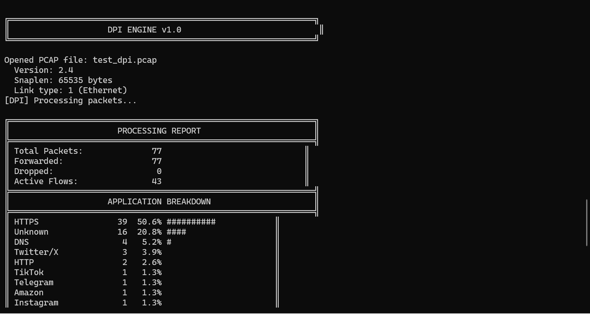
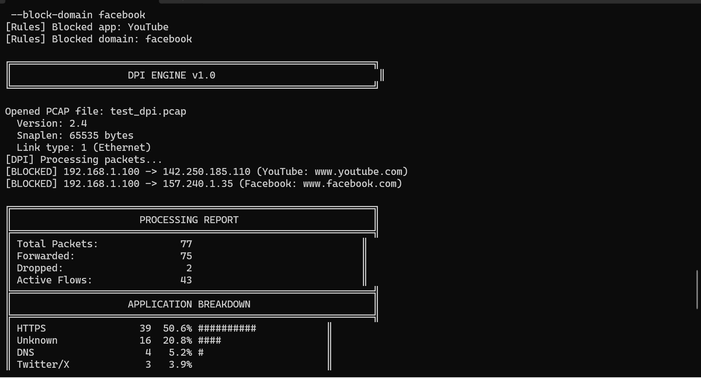
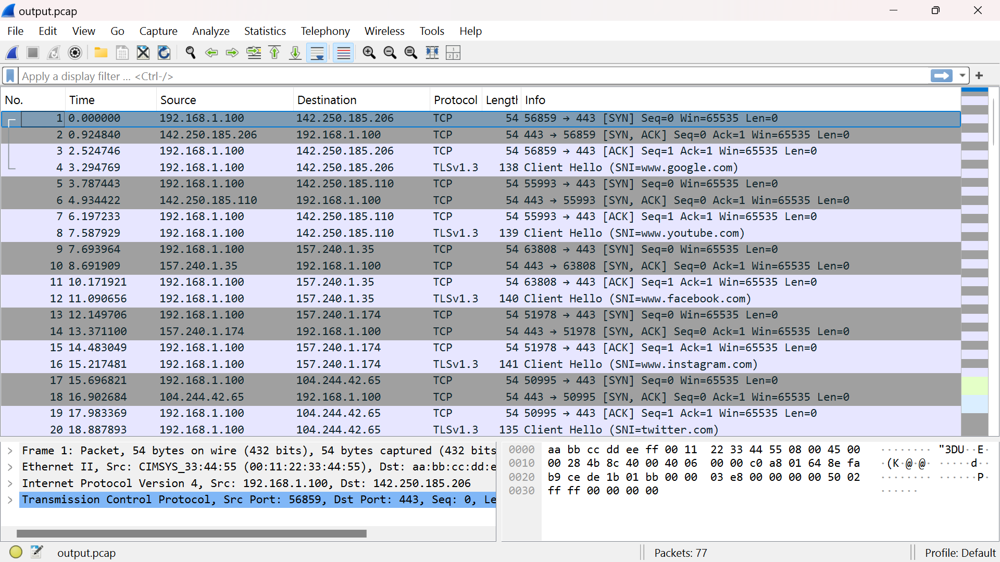

# 🚀 DPI Engine - Deep Packet Inspection System

A high-performance **Deep Packet Inspection (DPI) engine** built in **C++** that analyzes network traffic from PCAP files, extracts application-level information from encrypted HTTPS packets, and enforces rule-based traffic filtering.

**🌐 [Live Demo](https://dpi-engine-ncfp.onrender.com)** — try it in your browser, no setup required &nbsp;|&nbsp; ⭐ Star this repo if you find it useful

> Note: the demo may take ~20-30s to wake up on first load (free-tier hosting sleeps when idle).

---

## 📌 Overview

This project simulates how **ISPs, enterprise firewalls, and network security systems** inspect and control traffic.

It processes captured network packets and performs:

* Packet parsing (Ethernet, IP, TCP/UDP)
* Flow tracking using 5-tuple
* TLS SNI extraction (from HTTPS handshake)
* Application classification (YouTube, Facebook, etc.)
* Rule-based blocking (IP, domain, application)

---

## ⚙️ Features

* Deep Packet Inspection of PCAP files
* TLS SNI extraction from encrypted HTTPS traffic
* Application classification (YouTube, Facebook, Discord, etc.)
* Flow-based tracking using 5-tuple
* Rule engine for:

  * App blocking
  * Domain blocking
  * IP blocking
* Multi-threaded architecture
* Clean modular design
* Browser-based demo (FastAPI + web UI) for trying the engine without a local build

---

## 🧠 How It Works

```
PCAP → Parse → Flow Tracking → SNI Extraction → Classification → Rule Engine → Output PCAP
```

---

## 📸 Demo / Screenshots

### 🖥️ Normal DPI Output



---

### 🚫 Blocking in Action



---

### 🔍 Verification in Wireshark



---

## 🌐 Try It Online

No compiler, no setup — the [live demo](https://dpi-engine-ncfp.onrender.com) runs the same C++ engine behind a browser UI:

* Upload your own `.pcap`, or use the bundled sample traffic
* Toggle app/domain/IP blocking rules
* See the full report (packet counts, app breakdown, detected domains, blocked flows)
* Download the filtered output `.pcap`

---

## 🛠️ Build & Run (Windows - MSYS2 / CMD)

### Compile

```bash
g++ -std=c++17 -O2 -I include -o dpi_simple src/main_working.cpp src/pcap_reader.cpp src/packet_parser.cpp src/sni_extractor.cpp src/types.cpp
```

---

### Generate Test Data

```bash
python generate_test_pcap.py
```

---

### Run

```bash
dpi_simple.exe test_dpi.pcap output.pcap
```

---

### Run with Blocking Rules

```bash
dpi_simple.exe test_dpi.pcap output_blocked.pcap --block-app YouTube --block-domain facebook
```

---

## 📊 Sample Output

```
Total Packets: 77
Forwarded: 75
Dropped: 2

[BLOCKED]
YouTube → www.youtube.com
Facebook → www.facebook.com
```

---

## 🔍 Verification

Open the output `.pcap` file in Wireshark:

* Confirm blocked traffic is removed
* Verify application classification using TLS SNI

---

## 🧪 Technologies Used

* C++17
* Multi-threading (std::thread)
* Networking (TCP/IP, TLS)
* PCAP parsing
* Python (test data generation)
* FastAPI + Docker (web demo)

---

## ⚠️ Troubleshooting (Windows)

### 🔤 Weird Symbols in Output (Encoding Issue)

If you see garbled characters like:

```
Γòö ΓòÉ ΓòÜ ...
```

### ✅ Fix

Run this before executing:

```bash
chcp 65001
```

Then run again:

```bash
dpi_simple.exe test_dpi.pcap output.pcap
```

---

### 🧵 Multi-threading Issues

If multi-threaded version fails:

* Use `dpi_simple`
* Windows may not fully support `-pthread`

---

### 🐍 Python Not Found

```bash
python3 generate_test_pcap.py
```

---

## 🚀 Future Improvements

* Live packet capture (real-time DPI)
* QUIC / HTTP3 support
* Performance benchmarking
* Advanced rule engine (regex / ML-based classification)

---

## 🎯 Key Learnings

* Deep understanding of network protocols
* TLS handshake & SNI extraction
* Flow-based traffic analysis
* Multi-threaded system design
* Real-world DPI & firewall mechanisms

---

## 👤 Author

**Kartik Gautam**

---

⭐ If you like this project, consider giving it a star!